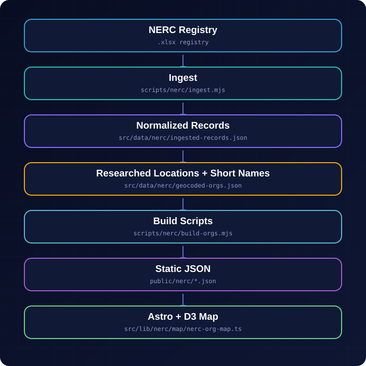
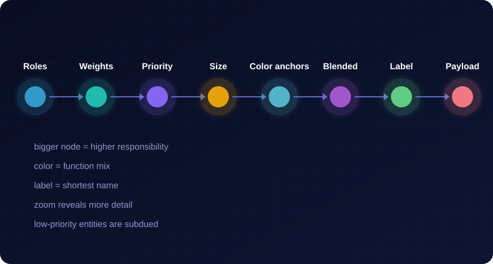
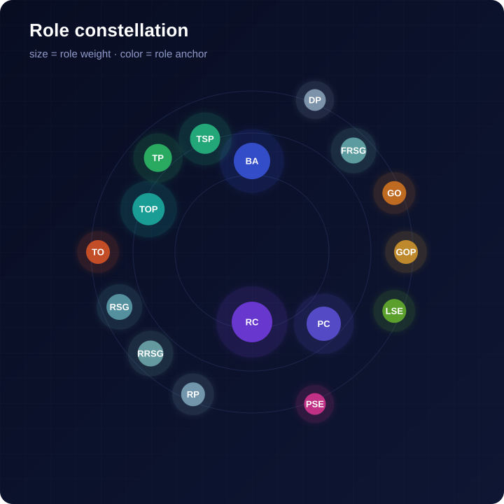
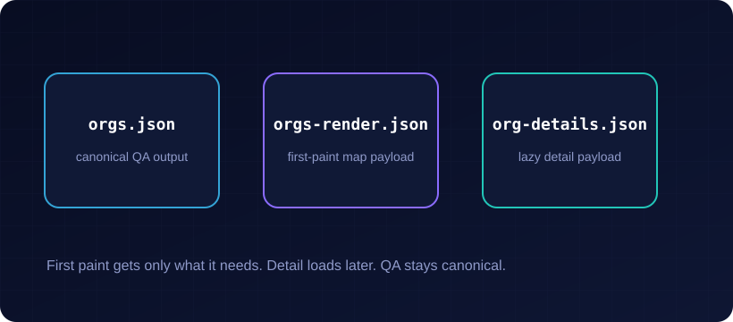
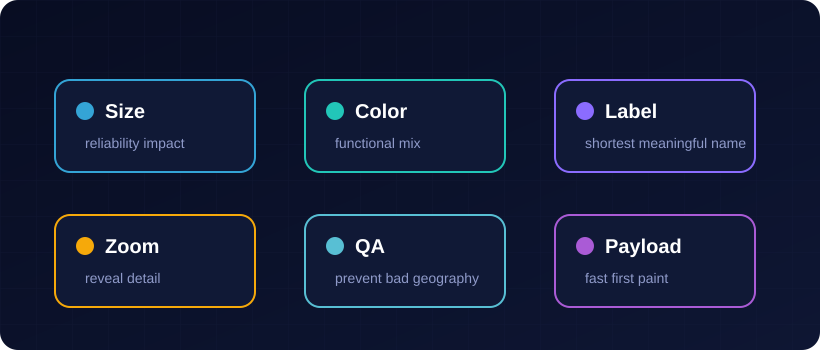

# NERC Grid Map

[Live Map →](https://willschenk.github.io/nerc-grid-map/)


This project turns the NERC compliance registry into an interactive map of North American bulk power system organizations. Each circle is a registered entity: size reflects weighted reliability responsibility, color reflects functional mix, and the label is the shortest meaningful name.

> _Independent visualization — not an official NERC product, and not a compliance source of truth._



Registry data flows through a deterministic pipeline: the published NERC spreadsheet is ingested and normalized, locations and short names are researched, build scripts produce static JSON, and the Astro + D3 client renders the map.



The hard part is not drawing dots. The hard part is making registry data readable without lying about role, priority, or geography. Rendering is opinionated: high-impact reliability roles get visual priority; lower-impact entities stay present but quiet.



The role constellation uses the same role weights and color anchors defined in `src/lib/nerc/roles.mjs`. Large central roles such as RC and BA carry more visual weight; smaller market, ownership, and support roles orbit further out.



The data is split for speed and reviewability: `orgs.json` stays canonical for QA, `orgs-render.json` stays small for first paint, and `org-details.json` loads heavier detail only when needed.



## Run locally

```bash
npm install
npm run dev
```

## Key files

```text
src/pages/index.astro              page markup
src/lib/nerc/map/nerc-org-map.ts   D3 map client
src/lib/nerc/roles.mjs             role weights, names, colors
scripts/nerc/                      ingest, build, QA, research prompt
public/nerc/                       generated map JSON and basemap
```
