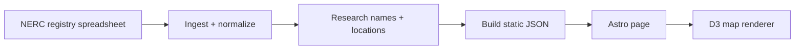
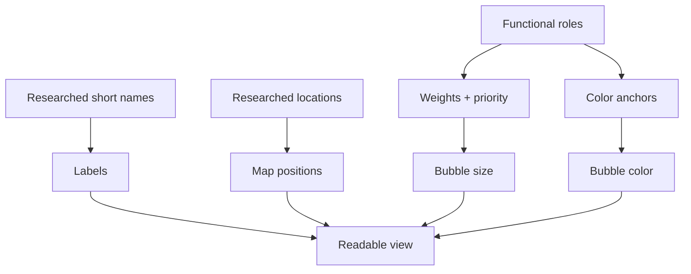

<div align="center">

# NERC Grid Map

**A fast visual index of NERC registered electric grid organizations.**

[**Open the live map →**](https://willschenk.github.io/nerc-grid-map/)

<a href="https://willschenk.github.io/nerc-grid-map/" aria-label="Open the live map">
  
</a>

</div>

## What this is

The NERC Grid Map turns registry records into a simple browser map. Each organization is plotted as a bubble, sized by reliability responsibility, colored by functional role mix, and labeled with the shortest practical name. It is built for exploration and data review, not official compliance determinations.

> Independent visualization — not a NERC product and not a compliance source of truth.

## How to read the map

| Visual cue | Meaning |
| --- | --- |
| Bigger bubble | Higher weight reliability functions such as RC, BA, PC, TOP, or TSP. |
| Color | Blended functional role mix from the role anchors in `src/lib/nerc/roles.mjs`. |
| Short label | Researched display name meant to stay readable at map scale. |
| Zoom level | More organizations appear as space becomes available. |
| Quiet or hidden entity | Lower priority organizations stay subdued until they can be shown cleanly. |

## Colors and roles

Bubble colors come from anchor hues defined for each functional role. Similar role mixes land at nearby colors, so you can quickly see the role composition at a glance.

| Role | Full name | Color |
| --- | --- | --- |
| RC | Reliability Coordinator | <span style="display:inline-block;width:0.8em;height:0.8em;border-radius:50%;background-color:#6f39d9"></span> `#6f39d9` |
| BA | Balancing Authority | <span style="display:inline-block;width:0.8em;height:0.8em;border-radius:50%;background-color:#3650d2"></span> `#3650d2` |
| PC | Planning Coordinator | <span style="display:inline-block;width:0.8em;height:0.8em;border-radius:50%;background-color:#584dcf"></span> `#584dcf` |
| TOP | Transmission Operator | <span style="display:inline-block;width:0.8em;height:0.8em;border-radius:50%;background-color:#1ba69b"></span> `#1ba69b` |
| TSP | Transmission Service Provider | <span style="display:inline-block;width:0.8em;height:0.8em;border-radius:50%;background-color:#25b07d"></span> `#25b07d` |
| TP | Transmission Planner | <span style="display:inline-block;width:0.8em;height:0.8em;border-radius:50%;background-color:#2cb364"></span> `#2cb364` |
| TO | Transmission Owner | <span style="display:inline-block;width:0.8em;height:0.8em;border-radius:50%;background-color:#cd5027"></span> `#cd5027` |
| GO | Generator Owner | <span style="display:inline-block;width:0.8em;height:0.8em;border-radius:50%;background-color:#c96f20"></span> `#c96f20` |
| GOP | Generator Operator | <span style="display:inline-block;width:0.8em;height:0.8em;border-radius:50%;background-color:#c98f2a"></span> `#c98f2a` |
| LSE | Load Serving Entity | <span style="display:inline-block;width:0.8em;height:0.8em;border-radius:50%;background-color:#60a92c"></span> `#60a92c` |
| PSE | Purchasing Selling Entity | <span style="display:inline-block;width:0.8em;height:0.8em;border-radius:50%;background-color:#cc328c"></span> `#cc328c` |
| DP | Distribution Provider | <span style="display:inline-block;width:0.8em;height:0.8em;border-radius:50%;background-color:#839bb3"></span> `#839bb3` |
| RP | Resource Planner | <span style="display:inline-block;width:0.8em;height:0.8em;border-radius:50%;background-color:#79a0b3"></span> `#79a0b3` |
| RSG | Reserve Sharing Group | <span style="display:inline-block;width:0.8em;height:0.8em;border-radius:50%;background-color:#5998a5"></span> `#5998a5` |
| FRSG | Frequency Response Sharing Group | <span style="display:inline-block;width:0.8em;height:0.8em;border-radius:50%;background-color:#62a4a6"></span> `#62a4a6` |
| RRSG | Reactive Reserve Sharing Group | <span style="display:inline-block;width:0.8em;height:0.8em;border-radius:50%;background-color:#6ba3a8"></span> `#6ba3a8` |

## How the data becomes the map



## Render model



## Payload split

| File | Purpose |
| --- | --- |
| `public/nerc/orgs.json` | Canonical generated organization data for review and QA. |
| `public/nerc/orgs-render.json` | Smaller first‑paint payload for the map. |
| `public/nerc/org-details.json` | Heavier detail loaded when an organization is selected. |

## Run locally

```bash
npm install
npm run dev
```

Requires Node `>=20.3.0`.

## Useful files

```text
src/pages/index.astro              page markup
src/lib/nerc/map/nerc-org-map.ts   D3 map client
src/lib/nerc/roles.mjs             role weights, names, colors
scripts/nerc/                      ingest, build, QA, research prompts
public/nerc/                       generated map JSON and basemap
```

The goal is to make the registry easy to inspect at a glance: who is registered, what role they hold, where they are, and how much visual priority they should receive. The map stays fast, readable, and honest about the underlying data.

## License

This project uses separate licenses for code and data.

- **Code** is licensed under the GNU Affero General Public License v3.0 only (`AGPL-3.0-only`).
- **Data, generated JSON payloads, researched organization names, locations, classifications, notes, and documentation** are licensed under Creative Commons Attribution‑NonCommercial‑ShareAlike 4.0 International (`CC BY‑NC‑SA 4.0`).

You may view, study, and non‑commercially reuse the data with attribution. You may not copy the dataset or generated map payloads for commercial use without permission.

This project is an independent visualization and is not a NERC product or official compliance source of truth.
