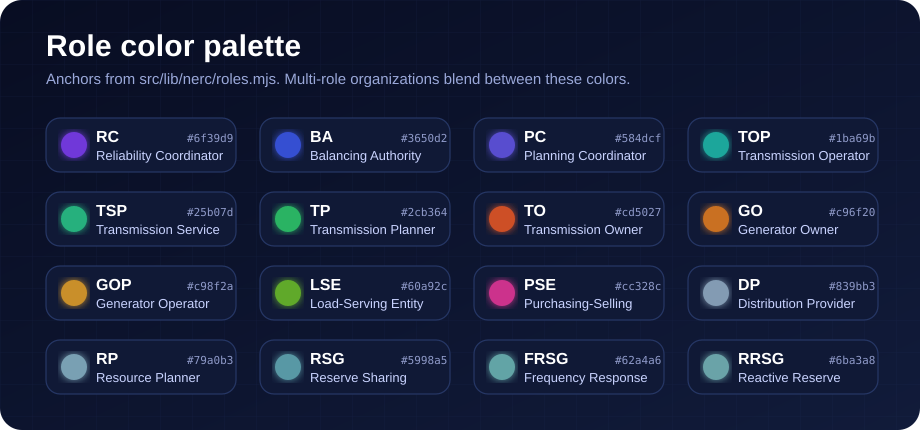
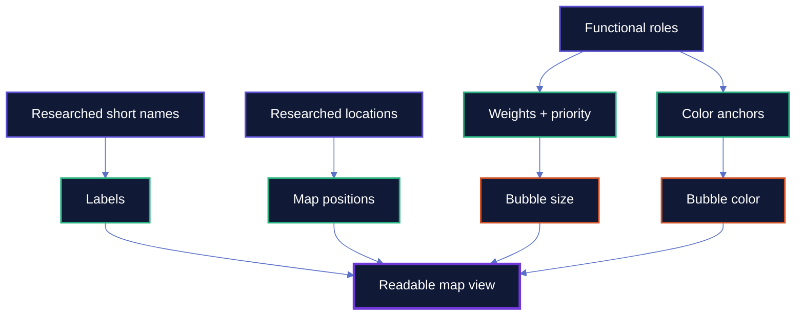

<div align="center">

# NERC Grid Map

**A readable, fast visual index of NERC-registered electric grid organizations.**

<p>
  <a href="https://willschenk.github.io/nerc-grid-map/"></a>
  
  
  
</p>

<a href="https://willschenk.github.io/nerc-grid-map/" aria-label="Open the live NERC Grid Map">
  
</a>

</div>

> [!IMPORTANT]
> This is an independent visualization. It is not a NERC product and is not an official compliance source of truth.

## What this is

The NERC Grid Map turns registry records into a browser map that is easy to scan. Each organization appears as a bubble: size reflects reliability responsibility, color reflects functional role mix, and the label uses the shortest practical name.

| The map is for | The map is not for |
| --- | --- |
| Exploring registered organizations | Making compliance determinations |
| Reviewing names, roles, regions, and locations | Replacing NERC source records |
| Spotting data-quality issues visually | Treating estimated geography as exact |

## How to read the map

| Visual cue | What it means |
| --- | --- |
| **Bigger bubble** | Higher-weight reliability functions such as RC, BA, PC, TOP, or TSP. |
| **Color blend** | Functional role mix from the role anchors in `src/lib/nerc/roles.mjs`. |
| **Short label** | Researched display name meant to stay readable at map scale. |
| **Zoom reveal** | More organizations appear as space becomes available. |
| **Quiet entity** | Lower-priority organizations stay subdued until they can be shown cleanly. |

## Role colors

Bubble colors come from fixed role anchors. Multi-role organizations blend between anchors, so similar role sets should feel visually related.



## Data pipeline


## Render model



## Project shape

| Area | Files | Purpose |
| --- | --- | --- |
| Map UI | `src/pages/index.astro`<br>`src/lib/nerc/map/nerc-org-map.ts` | Page shell and D3 map client. |
| Role model | `src/lib/nerc/roles.mjs` | Role weights, names, color anchors, and normalization. |
| Build scripts | `scripts/nerc/` | Ingest, build, QA, payload checks, and research queues. |
| Public payloads | `public/nerc/orgs-render.json`<br>`public/nerc/org-details.json` | Small first-paint data plus lazy-loaded detail. |
| QA data | `public/nerc/orgs.json` | Canonical generated organization output for review. |

## Run locally

```bash
npm install
npm run dev
```

Requires Node `>=20.3.0`.

## Design principle

The goal is to make the registry easy to inspect at a glance: who is registered, what role they hold, where they are, and how much visual priority they should receive. The map should stay fast, readable, and honest about the underlying data.

## License

This project uses separate licenses for code and data.

| Scope | License |
| --- | --- |
| Code | GNU Affero General Public License v3.0 only (`AGPL-3.0-only`) |
| Data, generated JSON payloads, researched names, locations, classifications, notes, and documentation | Creative Commons Attribution-NonCommercial-ShareAlike 4.0 International (`CC BY-NC-SA 4.0`) |

You may view, study, and non-commercially reuse the data with attribution. You may not copy the dataset or generated map payloads for commercial use without permission.
