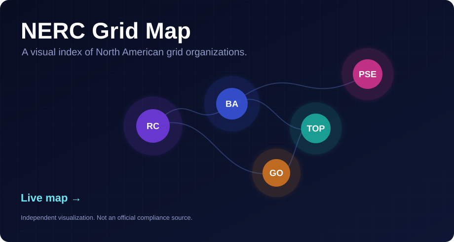
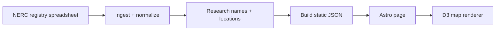
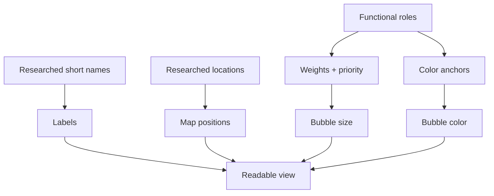

<div align="center">

# NERC Grid Map

**A fast visual index of NERC-registered electric grid organizations.**

[**Open the live map →**](https://willschenk.github.io/nerc-grid-map/)



</div>

## What this is

The NERC Grid Map turns registry records into a simple browser map. Each organization is plotted as a bubble, sized by reliability responsibility, colored by functional role mix, and labeled with the shortest practical name. It is built for exploration and data review, not official compliance determinations.

> Independent visualization — not a NERC product and not a compliance source of truth.

## How to read the map

| Visual cue | Meaning |
| --- | --- |
| Bigger bubble | Higher-weight reliability functions such as RC, BA, PC, TOP, or TSP. |
| Color | Blended functional role mix from the role anchors in `src/lib/nerc/roles.mjs`. |
| Short label | Researched display name meant to stay readable at map scale. |
| Zoom level | More organizations appear as space becomes available. |
| Quiet or hidden entity | Lower-priority organizations stay subdued until they can be shown cleanly. |

## How the data becomes the map



## Render model



## Payload split

| File | Purpose |
| --- | --- |
| `public/nerc/orgs.json` | Canonical generated organization data for review and QA. |
| `public/nerc/orgs-render.json` | Smaller first-paint payload for the map. |
| `public/nerc/org-details.json` | Heavier detail loaded when an organization is selected. |

## Run locally

```bash
npm install
npm run dev
```

Requires Node `>=20.3.0`.

## Useful files

```text
src/pages/index.astro              page markup
src/lib/nerc/map/nerc-org-map.ts   D3 map client
src/lib/nerc/roles.mjs             role weights, names, colors
scripts/nerc/                      ingest, build, QA, research prompts
public/nerc/                       generated map JSON and basemap
```

The goal is to make the registry easier to inspect at a glance: who is registered, what role they hold, where they are, and how much visual priority they should receive. The map should stay fast, readable, and honest about the underlying data.
